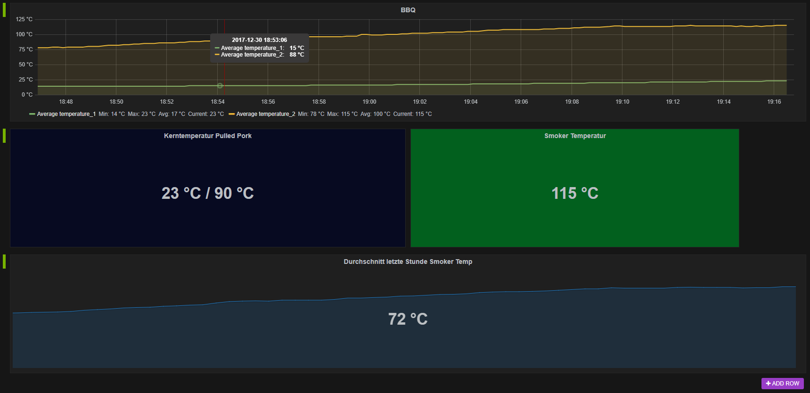

# MaverickBBQ
Receives Wireless BBQ Thermometer Telegrams via RF-Receiver attached to Raspberry Pi and sends it to a Elastic Search Index and display the data using e.g. Grafana:



This Dashboard is provided [here](grafana.json)

# Requirements

## pigpiod

Needs pigpiod (http://abyz.co.uk/rpi/pigpio/pigpiod.html) running to work
start with: 

`pigpiod -x -1`

## Install httplib2
`sudo apt-get install python3-httplib2`

## Install grafana on Raspberry

[Install Grafana](https://github.com/fg2it/grafana-on-raspberry)

## Install Elastic Search

[Install ES](http://www.erewhon-network.net/installation-of-selk-syslog-ng-elastichsearch-logstash-and-kibana-in-a-raspberry-pi3/)

# Connect 433 MHZ Receiver 

Data pin from your receiver to GPIO 18 on your raspberry. GND and Power according to the image bellow:


# Prepare Elastic Search

## Create index

`PUT`
`http://192.168.1.111:9200/bbq/`
```json
{
    "settings" : {
        "index" : {
            "number_of_shards" : 1, 
            "number_of_replicas" : 1
        }
    }
}
```

## create reading
`POST`
`http://192.168.1.111:9200/bbq/_mapping/reading`
```json
{
      "reading": {
        "properties": {
          "created": {
            "type": "long"
          },
          "checksum": {
            "type": "double"
          },
          "temperature_1": {
            "type": "long"
          },
          "temperature_2": {
            "type": "long"
          }
        }
      }
}
```

# Usage 
`maverick.py`

## Install as service

Copy the bbq.service file to:

`/etc/systemd/system/bbq.service`
 
Reload systemd: 

`sudo systemctl daemon-reload`
 
Enable the service:

`sudo systemctl enable bbq.service`

Start the service:

`sudo systemctl start bbq.service`

Check Log:

`sudo journalctl --unit=bbq`

`tail -f /var/log/syslog | grep bbq`


 